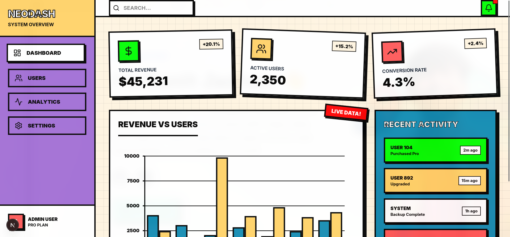

# 🟨 Neobrutalism Components Skill

A highly directive, high-agency AI agent skill that forces Claude, Cursor, and OpenCode to generate authentic, high-contrast, physical Neobrutalist web interfaces.

Tired of AI generating boring, soft, corporate UIs with pastel gradients and subtle drop shadows? This skill injects a strict Neobrutalist design system into your AI's context, forcing it to use thick black borders, hard offset shadows, aggressive typography, and high-contrast colors.

## 🚀 Installation

Install this skill globally using the [Skills CLI](https://skills.sh/):

```bash
npx skills add ChindanaiNaKub/neobrutalism-components-skill
```

## 🧠 What this Skill does

When this skill is active, your AI will automatically:
1. **Enforce the Neobrutalist Aesthetic:** Bans soft shadows (`shadow-md`), blur effects (`backdrop-blur`), and rounded pills. Enforces `border-4 border-black` and hard offset shadows (`shadow-[8px_8px_0px_0px_rgba(0,0,0,1)]`).
2. **Use the Official Registry:** Automatically fetches and installs accessible React components from `neobrutalism.dev` via `npx shadcn@latest add https://neobrutalism.dev/r/...` instead of hallucinating raw HTML.
3. **Apply the "Physical Press":** Ensures all buttons and interactive cards physically depress into the screen on hover/active states.
4. **Inject Advanced Patterns:** Proactively adds retro grid backgrounds, floating geometric accents, stamp typography, and comic-book style layouts.

## 🛠️ Requirements

- A React or Next.js project
- Tailwind CSS v4

## 📚 Resources

- [Neobrutalism.dev](https://www.neobrutalism.dev/) - Official component library

## 💡 Example Prompts

Once installed, try asking your AI:
- *"Build a SaaS landing page hero section."*
- *"Create a pricing section with 3 tiers."*
- *"Build a dashboard layout with a sidebar and a bar chart."*

The AI will automatically read the skill, install the necessary `neobrutalism.dev` components, and compose them using strict Neobrutalist design rules.

### Example Output

**Prompt:** *"Build a dashboard layout with a sidebar and a bar chart. using neobrutalism skills"*



### Demo


**Live Demo:** [https://dashboard-apcoepq1c-prabs-projects-ba76ec4a.vercel.app/](https://dashboard-apcoepq1c-prabs-projects-ba76ec4a.vercel.app/)

---
*Built for the open agent skills ecosystem.*